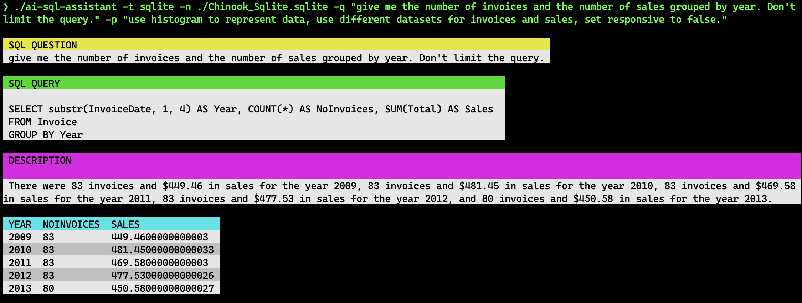

# 🤖 ai-sql-assistant

[](https://github.com/henomis/ai-sql-assistant/actions/workflows/release.yml) [](https://godoc.org/github.com/henomis/ai-sql-assistant) [](https://goreportcard.com/report/github.com/henomis/ai-sql-assistant) [](https://github.com/henomis/ai-sql-assistant/releases)

This is a simple AI SQL query builder helper written in GO. It uses OpenAI API to generate a plausible SQL query from a given question. Generated query is executed and results are displayed. And, if you provide a plot question, it will generate a plot for you.

It only supports MySQL and SQLite for now. This project is powered by [LinGoose](https://github.com/henomis/lingoose) 🪿




If you like this project, give it a ⭐️ and share it with friends!

## Installation

Be sure to have a working Go environment, then run the following command:

```
go install github.com/henomis/ai-sql-assistant@latest
```

### From source code

Clone the repository and build the binary:

```
go build .
```

### Pre-built binaries

Pre-built binaries are available for Linux, Windows and macOS on the [releases page](https://github.com/henomis/ai-sql-assistant/releases/latest).

## Usage

⚠️ ai-sql-assistant requires an OpenAI API key as `OPENAI_API_KEY` environment variable.

```shell
Usage of ./ai-sql-assistant:
  -k string
        openai api key (defaults to OPENAI_API_KEY env var)
  -n string
        name of the datasource (database path|connection string)
  -p string
        instructions to plot the datasource
  -q string
        question to ask the datasource
  -t string
        type of the datasource (sqlite|mysql)
```

```
ai-sql-assistant -n ./Chinook_Sqlite.sqlite -t sqlite -q "give me top 4 artists name and number of songs"
```

## License

© Simone Vellei, 2023~time.Now() Released under the MIT License
